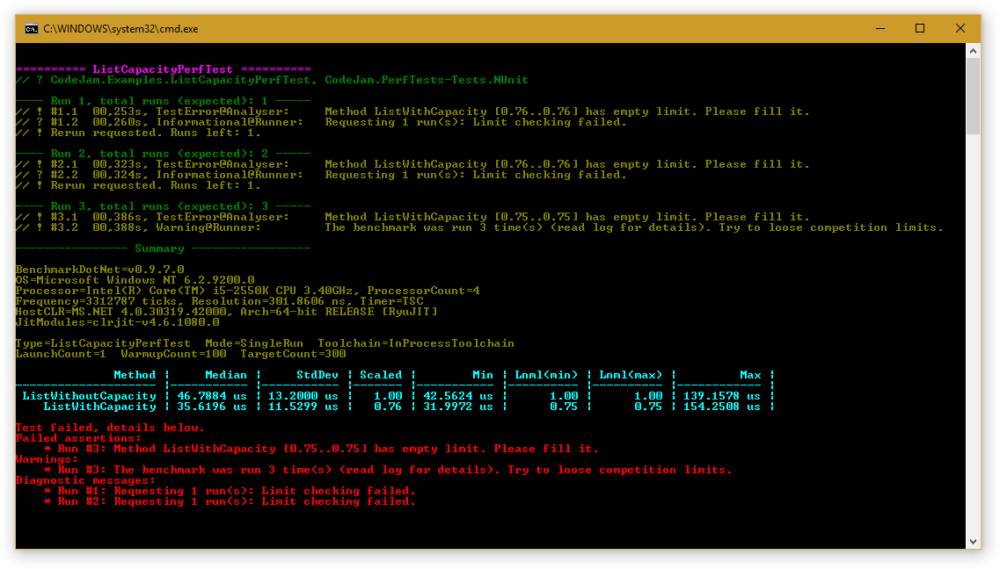

# [WORK IN PROGRESS] CodeJam.PerfTests.
Please do not remove [WORK IN PROGRESS] modifier until the doc is complete.
Until this use with care.

## What it is? (short version)

CodeJam.PerfTests is performance testing framework for .Net projects.
It allows to compare multiple implementations by execution time (memory limits coming soon),
to annotate implementations with timing limits and to check the limits each time the test is run.

## TL;DR (NUnit version):

>**SIDENOTE**
>
>Here and below all samples are based on NUnit framework. Actually there's no significant difference, 
only package name and attributes should be changed.
For example how to use CodeJam.PerfTests with other test frameworks see the 
[MS test version](Example.MSTest.md) and [xUnit version](Example.xUnit.md).

1. Create a new unit test project.
2. Add a reference to the CodeJam.PerfTests.NUnit nuget package.
3. Add a file with the following code:
 ```c#
using System;
using System.Threading;

using CodeJam.PerfTests;

using NUnit.Framework;

namespace CodeJam.Examples
{
	// A perf test class.
	[Category("PerfTests: NUnit examples")]
	public class SimplePerfTest
	{
		private const int Count = 10 * 1000;

		// Perf test runner method.
		[Test]
		public void RunSimplePerfTest() => Competition.Run(this, CompetitionHelpers.DefaultConfigAnnotate);

		// Baseline competition member. Other competition members will be compared with this.
		[CompetitionBaseline]
		public void Baseline() => Thread.SpinWait(Count);

		// Competition member #1. Should take ~3x more time to run.
		[CompetitionBenchmark]
		public void SlowerX3() => Thread.SpinWait(3 * Count);

		// Competition member #2. Should take ~5x more time to run.
		[CompetitionBenchmark]
		public void SlowerX5() => Thread.SpinWait(5 * Count);

		// Competition member #3. Should take ~7x more time to run.
		[CompetitionBenchmark]
		public void SlowerX7() => Thread.SpinWait(7 * Count);
	}
```

4. Select release build and run the `RunSimplePerfTest` test. You should get something like this
 (look at `[CompetitionBenchmark]` parameters):
 ```c#
	// A perf test class.
	[Category("PerfTests: NUnit examples")]
	public class SimplePerfTest
	{
		private const int Count = 10 * 1000;

		// Perf test runner method.
		[Test]
		public void RunSimplePerfTest() => Competition.Run(this, CompetitionHelpers.DefaultConfigAnnotate);

		// Baseline competition member. Other competition members will be compared with this.
		[CompetitionBaseline]
		public void Baseline() => Thread.SpinWait(Count);

		// Competition member #1. Should take ~3x more time to run.
		[CompetitionBenchmark(2.93, 3.05)]
		public void SlowerX3() => Thread.SpinWait(3 * Count);

		// Competition member #2. Should take ~5x more time to run.
		[CompetitionBenchmark(4.89, 5.14)]
		public void SlowerX5() => Thread.SpinWait(5 * Count);

		// Competition member #3. Should take ~7x more time to run.
		[CompetitionBenchmark(6.82, 7.21)]
		public void SlowerX7() => Thread.SpinWait(7 * Count);
	}
```
 yep, it's a magic:)

5. After the `[CompetitionBenchmark]` attributes are filled with actual timing limits 
you can disable source auto-annotation. To do this, use the `CompetitionHelpers.DefaultConfig`:
 ```c#
		[Test]
		public void RunSimplePerfTest() => Competition.Run(this, CompetitionHelpers.DefaultConfig);
```
6. Now the test will fail if timings do not fit into limits. To proof, set wrong limit for any competiton method and run the test.
As example:
 ```c#
		[CompetitionBenchmark(1, 1)]
		public void SlowerX7() => Thread.SpinWait(7 * Count);
```
 The test should fail with text like this:
 ```
Test failed, details below.
Failed assertions:
    * Run #3: Method SlowerX7 [6.99..6.99] does not fit into limits [1.00..1.00]
Warnings:
    * Run #3: The benchmark was run 3 time(s) (read log for details). Try to loose competition limits.
Diagnostic messages:
    * Run #1: Requesting 1 run(s): Limit checking failed.
    * Run #2: Requesting 1 run(s): Limit checking failed.
```

Well, that's all.

## Ok, what it is? (longer one)

The CodeJam.PerfTest framework is built on top of amazing [BenchmarkDotNet](https://github.com/PerfDotNet/BenchmarkDotNet),
the best and most mature benchmarking framework for .Net.

Of course, there are another decent frameworks such as 
[NBench](https://github.com/petabridge/NBench) or [SimpleSpeedTester](https://github.com/theburningmonk/SimpleSpeedTester) 
but, well, BenchmarkDotNet is the best one. Kudos to authors!

Ok, back to topic. Why not just use one of these? Is there a room for another testing framework or it's all about 
https://xkcd.com/927/ ?

Well, it turns out that benchmarks and perftests ARE NOT the same.

Benchmark runners are aimed to measure perf metrics of multiple implementations and to do the measurements as precise as 
it's possible.
This means that a huge amount of work [should be done](https://github.com/PerfDotNet/BenchmarkDotNet#how-it-works) 
to fight against various side-effects.
In short, [benchmarking](https://andreyakinshin.gitbooks.io/performancebookdotnet/content/science/microbenchmarking.html) 
[is](http://mattwarren.org/2014/09/19/the-art-of-benchmarking/) 
[hard](http://www.hanselman.com/blog/ProperBenchmarkingToDiagnoseAndSolveANETSerializationBottleneck.aspx) :)

The goals for performance testing are different. This is by design:

* there will be a lot of perftests and these will be run continiously 
(and you do not want to [wait for hours](https://twitter.com/jonskeet/status/735415336825192448) for the tests completion),
* the tests will be run on different hardware from tablets to CI servers,
* and, to be honest, you're not interested in preciseness. There's no point in direct comparison of
`ImplA` that takes 0.1 sec when run on a tablet and `ImplB` that takes 0.05 sec when run on dedicated testserver.

Absolute timings means nothing until you're sure that benchmarks are run under exactly same conditions.
In actual, `ImplA` from example above takes 0.015 sec to complete when run on same hardware the `ImplB` was run.

And here's one more thing: you cannot trust benchmark results obtained from code being run in clean room conditions.
In production your code will be influenced by the environment and benchmark ignoring these side effects will lie to you.  
If your code does a lot of memory reads/writes it will suffer from CPU cache hits caused by concurrent reads.  
If you do a lot of short-lived allocations, GC collection caused by another code will promote your objects into higher 
generation increasing the gc overhead.  
Reading from HDD/Network? Still the same - unexpected latencies will hurt you.

All of the above means that:
* You do want to get reproducible results that are as close to the results from production as it's possible.
* You do want to be able to compare benchmark results obtained from different test runs, from different machines 
and from different implementations.
* You do want to have a lot (a lot means hundreds and thousands) of tests and to maintain them as easy as usual unit tests.

CodeJam.PerfTest handles all of the above.


## Creating a new performance test

### Code for performance test
Let's say we want to write a perftest that measures cost of list resizing.
We will start with a class with two methods:
```cs
	public class ListCapacityPerfTest
	{
		private const int Count = 10000;

		public int ListWithoutCapacity()
		{
			var data = new List<int>();
			for (int i = 0; i < Count; i++)
				data.Add(i);

			return data.Count;
		}

		public int ListWithCapacity()
		{
			var data = new List<int>(Count);
			for (int i = 0; i < Count; i++)
				data.Add(i);

			return data.Count;
		}
	}
```

Next, we should choose the baseline (or reference) implementation all other benchmark members will be compared to.
In simple tests like this it's actually doesn't matter which one to choose. However, in large and complex perftests 
baseline should be chosen with caution. Time of execution of the baseline should be stable,
it should not be in order of magnitude slower (or faster) than another competitors and so on.

**TODO:** link to the guidelines for the perftests.

So, let's mark the `ListWithoutCapacity()` as `[CompetitionBaseline]` and `ListWithCapacity()` as a `[CompetitionBenchmark]`

### Code that runs the performance test
Next, you should write code that runs the perftest. Here's how to do it with NUnit:
```
		[Test]
		public static void RunListCapacityPerfTest() => 
			Competition.Run<ListCapacityPerfTest>(CompetitionHelpers.DefaultConfig);
// or 
		[Test]
		public void RunListCapacityPerfTest() => 
			Competition.Run(this, CompetitionHelpers.DefaultConfig);
```

The first `Competition.Run()` overload is universal - it can be placed inside the class or outside,
 but it requires to explicitly the type of the perftest class explicitly.

The second one infers the type from `this` parameter. Of course, there's no point
 in using it if the `ListCapacityPerfTest` method is not member of the perftest class.

Also, you can use default console runner to run the performance test:
```
		private static void Main()
		{
			ConsoleCompetitionRunner.Run<ListCapacityPerfTest>(CompetitionHelpers.DefaultConfig);

			Console.ReadKey();
		}
```

output will look like this:


### Setting the limits:
As you can see the perftest was failed with message
```
Test failed, details below.
Failed assertions:
    * Run #3: Method ListWithCapacity [0.77..0.77] has empty limit. Please fill it.
Warnings:
    * Run #3: The benchmark was run 3 time(s) (read log for details). Try to loose competition limits.
Diagnostic messages:
    * Run #1: Requesting 1 run(s): Limit checking failed.
    * Run #2: Requesting 1 run(s): Limit checking failed.
```

As you can see from the screen above the timings when the test is run a are somewhere between [0.76..0.78].

## Running existing perftests

### Competition limits

CodeJam.PerfTest uses so called competition performance testing approach. 
All methods in benchmark are not compared directly to each other. Instead of this an additional baseline 
implementation method is included into benchmark (it should be annotated with `[CompetitionBaseline]` attribute)
and the relative-to-baseline timings are used.

By default limits for each method in the competition are stored as attribute annotation. The 
```cs
		[CompetitionBenchmark(2.92, 3.05)]
		public void SlowerX3() => Thread.SpinWait(3 * Count);
```
line means that method is expected to take 2.92x..3.05x relative to the baseline.

If there's no baseline method in the competition the test fill fail with the following message
 (comment out the `[CompetitionBaseline]` attribute to check):
```
Test completed with errors, details below.
Errors:
    * Run #1: The benchmark SimplePerfTest has no baseline.
```

### Viewing the output: 
In addition to short message CodeJam.PerfTest provides detailed information that simplifies troubleshooting.
It can be viewed via test output view. Output for passed tests looks like this:
```
BenchmarkDotNet=v0.9.7.0
OS=Microsoft Windows NT 10.0.10586.0
Processor=Intel(R) Core(TM) i5-2550K CPU 3.40GHz, ProcessorCount=4
Frequency=3312787 ticks, Resolution=301.8606 ns, Timer=TSC
HostCLR=MS.NET 4.0.30319.42000, Arch=64-bit RELEASE [RyuJIT]
JitModules=clrjit-v4.6.1080.0

Type=SimplePerfTest  Mode=SingleRun  Toolchain=InProcessToolchain  
LaunchCount=1  WarmupCount=100  TargetCount=300  

   Method |      Median |     StdDev | Scaled |         Min | Lnml(min) | Lnml(max) |         Max |
--------- |------------ |----------- |------- |------------ |---------- |---------- |------------ |
 Baseline |  45.8828 us |  3.6272 us |   1.00 |  44.3735 us |      1.00 |      1.00 |  74.8614 us |
 SlowerX3 | 134.9317 us |  6.6991 us |   2.94 | 126.4796 us |      2.95 |      2.95 | 171.7587 us |
 SlowerX5 | 229.4141 us | 15.8135 us |   5.00 | 222.4713 us |      5.00 |      5.00 | 360.1197 us |
 SlowerX7 | 320.8779 us | 17.5443 us |   6.99 | 295.5216 us |      6.96 |      6.96 | 428.9440 us |


// !====================================
// !Run 1, total runs (expected): 1.
// ? #1.1  00,659s, Informational@Analyser: CompetitionAnalyser: All competition limits are ok.
```

### If limits are failed

In case when some of methods that participating in limits do not fit into limits the benchmark is rerun again (up to three times by default).
It helps to detect the case when limits are too tight and test fails time-to-time. In this case the test will complete with following warnig:
```
Test completed with warnings, details below.
Warnings:
    * Run #2: The benchmark was run 2 time(s) (read log for details). Try to loose competition limits.
Diagnostic messages:
    * Run #1: Requesting 1 run(s): Limit checking failed.
    * Run #2: CompetitionAnalyser: All competition limits are ok.
```

If the limits were failed three times in a row, the test will fail with message
```
Test failed, details below.
Failed assertions:
    * Run #3: Method SlowerX3 [3.01..3.01] does not fit into limits [2.90..2.90]
Warnings:
    * Run #3: The benchmark was run 3 time(s) (read log for details). Try to loose competition limits.
Diagnostic messages:
    * Run #1: Requesting 1 run(s): Limit checking failed.
    * Run #2: Requesting 1 run(s): Limit checking failed.
```


### Ignoring limits for some of methods:
If you want to temporary exclude the method from the competition just add `DoesNotCompete = true` to the annotation, like this
```cs
		[CompetitionBenchmark(2.92, 3.05, DoesNotCompete = true)]
		public void SlowerX3() => Thread.SpinWait(3 * Count);
```
or use `[Benchmark]` attribute instead of `[CompetitionBenchmark]`.
