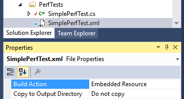

# CodeJam.PerfTests Source Annotations

> **META-NOTE**
>
> Places to update are marked with *~…~*.

[TOC]

## Source annotations

Source annotations provides a way to specify limits for the competition. Current implementation supports limits for relative-to-baseline timings only, *~memory limits coming soon~*.

## Annotate sources using attributes

Each competition method should be annotated with `[CompetitionBenchmark]` attribute (or `[CompetitionBaseline]` attribute for baseline method). Default constructor of `CompetitionBenchmarkAttribute` does not specify any limit for the method so there will be warning message like this:

```
The benchmark %BenchmarkMethodName% ignored as it has empty limit. Update limits to include benchmark in the competition.
```

There're multiple ways to specify limits for the competition. First and the recommended one is to enable source annotations using `[CompetitionAnnotateSources]` or `[CompetitionReannotateSources]`(use it to ignore existing source annotations) attribute. Run the perftest and the code will be updated with actual competition limits.

> **WARNING**
>
> Be sure to use source control before enabling the source annotation feature. If not you'll lose your current perftest limits as they will be overwritten without confirmation.

Second, you can set limits explicitly, 

```c#
		// Competition member #1. Should take ~3x more time to run.
		[CompetitionBenchmark(2.96, 3.08)]
		public void SlowerX3() => Thread.SpinWait(3 * Count);
```

Third, if you do want to obtain actual limits without updating the sources, apply the `CompetitionPreviewLimitsAttribute` and run the perftest. Here's part of the output:

```
---- Run 3, total runs (expected): 3 -----
// ? #3.1  04.123s, Informational@Analyser: CompetitionAnnotateAnalyser: All competition limits are ok.
// !<-- ------ xml_annotation_begin ------
<CompetitionBenchmarks>
	<Competition Target="CodeJam.Examples.SimplePerfTest, CodeJam.Examples">
		<Candidate Target="Baseline" Baseline="true" />
		<Candidate Target="SlowerX3" MinRatio="2.97" MaxRatio="3.09" />
		<Candidate Target="SlowerX5" MinRatio="4.95" MaxRatio="5.15" />
		<Candidate Target="SlowerX7" MinRatio="6.86" MaxRatio="7.14" />
	</Competition>
</CompetitionBenchmarks>
// !--> ------- xml_annotation_end -------
```

Now you can add new limits into `[CompetitionBenchmark]` annotations manually or store the annotations as a XML file


## Annotating sources using XML file

Setting competition limits using `[CompetitionBenchamrk]` does not work well with dynamically emitted or generated code. Code generation does not preserve source changes so you need to store the limits somewhere else. Meet the XML source annotations.

### Adding new XML annotation file

Add a new empty XML file into your project and mark it as an Embedded Resource. It's recommended to locate it near corresponding source file and to give it the same name the file has. Like this:



Next, annotate the perftest with `CompetitionMetadataAttribute`:

```c#
	[CompetitionMetadata(
		// Case-sensitive name of the manifest resource stream
		"CodeJam.Examples.PerfTests.SimplePerfTest.xml",
		UseFullTypeName = true)]
	public class SimplePerfTest
	{
		...
	}
```

> **HINT** 
>
> As far as I know the exact logic the resource names are generated is undocumented. You can use [this answer](https://social.msdn.microsoft.com/Forums/vstudio/en-US/632d6914-8c90-450e-8ea0-fa60d2c3b6b6/manifest-name-for-embedded-resources?forum=msbuild) as a quick reference or [check the implementation](https://github.com/Microsoft/msbuild/blob/master/src/XMakeTasks/CreateCSharpManifestResourceName.cs) for more details.

Next, copy limits obtained from run with `[CompetitionPreviewLimits]` attribute into XML file:

```xml
<?xml version="1.0" encoding="utf-8" ?>
<CompetitionBenchmarks>
	<Competition Target="CodeJam.Examples.PerfTests.SimplePerfTest, CodeJam.Examples">
		<Candidate Target="Baseline" Baseline="true" />
		<Candidate Target="SlowerX3" MinRatio="2.97" MaxRatio="3.09" />
		<Candidate Target="SlowerX5" MinRatio="4.90" MaxRatio="5.10" />
		<Candidate Target="SlowerX7" MinRatio="6.85" MaxRatio="7.13" />
	</Competition>
</CompetitionBenchmarks>
```

By default target type name format is full type name followed with name of type's assembly. You may shorten it to simple type name, `Target="SimplePerfTest"`. Don't forget to remove the `UseFullTypeName = true` from `[CompetitionMetadata]` annotation then.

> **HINT**
>
> Nested type names uses '+' symbol as a separator, as example
>
> General rule is, if you're unsure what the target name should be, just run the perftest with `CompetitionPreviewLimitsAttribute` applied and check the output.


### Using existing XML annotations file

If you want to reuse existing XML annotations file you had to specify path to it explicitly. The same applies if name of the XML annotations file does not match to the sources file name. Here's how to do it:

Let's say you have source file 'PerfTests\SimplePerfTest.cs' and the XML annotations file is located at `Assets\PerfTestAnnotations.xml`.


Use the `MetadataResourcePath` property to set path to the XML annotations file.

```c#
	[CompetitionMetadata(
		// Case-sensitive name of the manifest resource stream
		"CodeJam.Examples.Assets.PerfTestAnnotations.xml",
		// Path (should be relative to the perftest source file path)
		MetadataResourcePath = @"..\Assets\PerfTestAnnotations.xml",
		UseFullTypeName = true)]
	public class SimplePerfTest
	{
		...
	}
```


## Annotating source from previous run log file

Sometimes you have to annotate sources with results obtained from another machine.

To do so:

1. Enable both `ContinuousIntegrationMode` and `AnnotateSources` features for runs performed on another machine. You can do it via app.config (check [ConfigurationSystem](ConfigurationSystem.md) document for more information). If the perftest is run under continuous integration service the `ContinuousIntegrationMode` is enabled automatically.

2. Obtain the URI to the log file containing XML annotations. Tests being run under continuous itegration mode writes results into `%assemblyname%.ImportantOnly.PerfTests.log`. Also, you can add custom loggers if you wish. You can copy (or download) log file to local directory or obtain the URL to the log file (if the tests are run under CI server and the log is added into artifacts). For example, AppVeyor url format is
```
https://ci.appveyor.com/api/projects/%owner%/%project%/artifacts/%assemblyname%.ImportantOnly.PerfTests.log?all=true 
```
​	and TeamCity url format will be
```
https://%ci_server%/repository/download/%project%/.lastFinished/%assemblyname%.ImportantOnly.PerfTests.log
```
​	Check documentation for your CI service for exact syntax.

3. Pass the Uri as a value of the `PreviousRunLogUri` feature. You can use app.config or pass it as constructor app to the `CompetitionAnnotateSourcesAttribute`
```c#
		[CompetitionAnnotateSources(@"d:\runs\last.log")]
		// -or-
		[CompetitionAnnotateSources(@"\\network\share\runs\last.log")]
		// -or-
		[CompetitionAnnotateSources(@"https://www.example.com/url.to.last.log")]
		public class SimplePerfTest
		{
			...
		}
```

4. Run the test **with enabled`AnnotateSources` feature**. If limits were updated there will be message like this:
```
Test completed with warnings, details below.
Warnings:
    * Run #1: The sources were updated with new annotations. Please check them before commiting the changes.
Diagnostic messages:
    * Run #1: Competition limits were updated from log file 'url-to-log-file'.
```

5. Done!


## Auto-annotate sources from runs under continuous integration service

You have two options there. 

**First**, you can enable source annotations mode, add the log into build artifacts, setup previous run log URI, and just run perftests. Limit adjustments performed during CI run will be applied to sources on local run. Check previous section for more.

**Second**, you can explicitly disable the `ContinuousIntegrationMode` feature, enable source annotations and setup CI server to do autocommit sources if tests succeed. As example, here's how to do it [with AppVeyor builds](https://www.appveyor.com/docs/how-to/git-push/). We do not recommend this approach. If performance will degrade unexpectedly there will be's no notifications and the limits will be silently overwritten.
